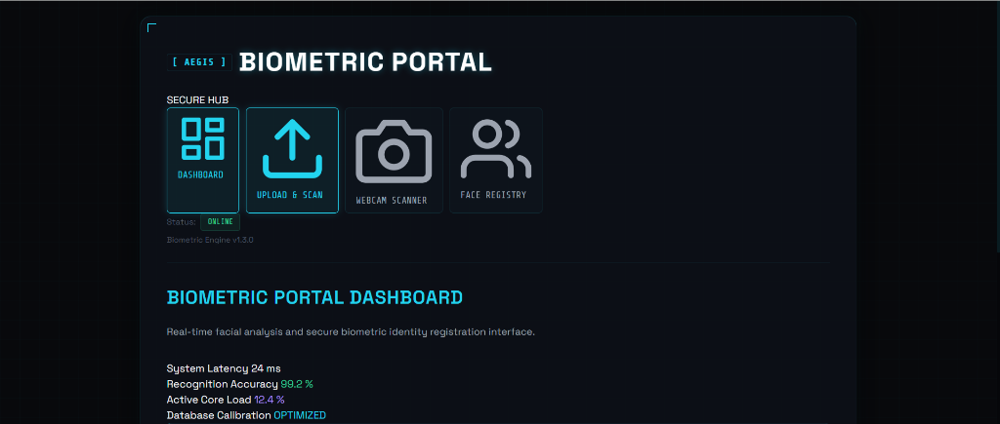
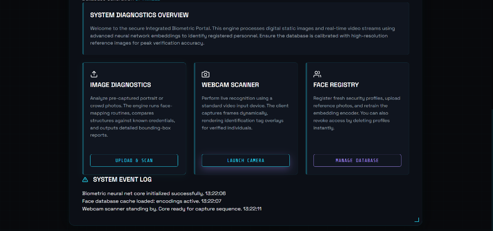
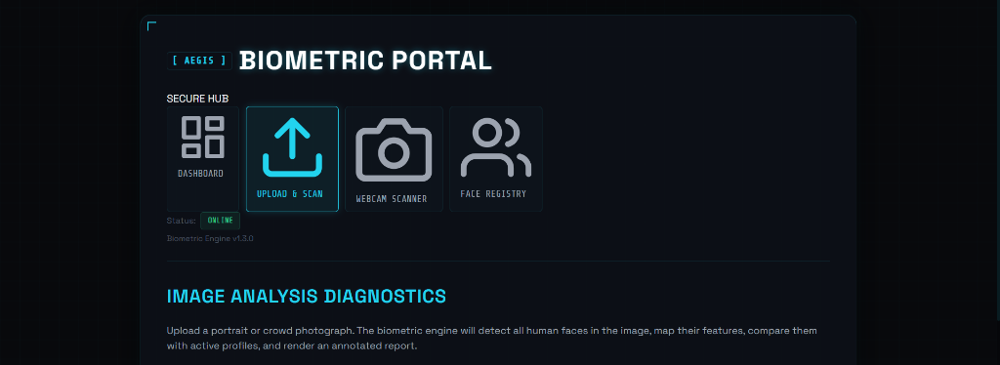
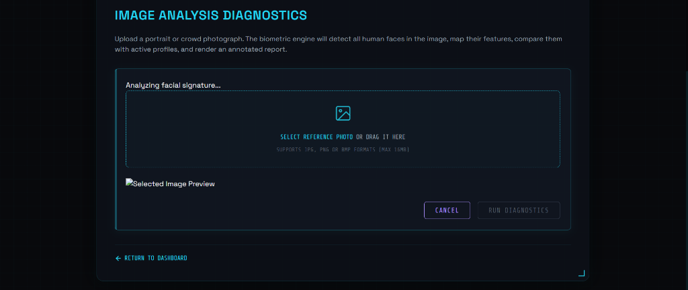
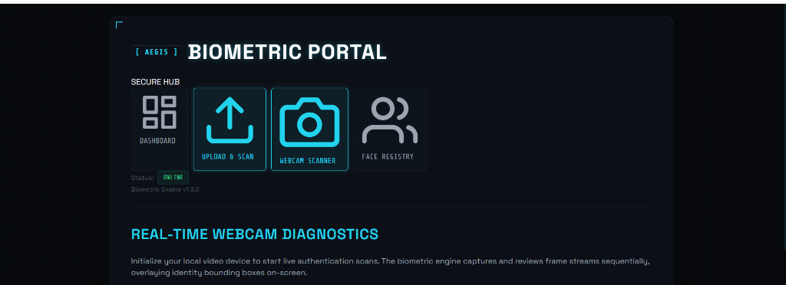

# Aegis Biometric Portal - Face Recognition System

A high-performance, web-based Face Recognition System built with Python, Flask, OpenCV, and `face_recognition` (`dlib`). Featuring real-time webcam frame processing, annotated image analysis, and a modern biometric security interface.

---

## 📸 Interface Preview

### 1. Main Dashboard


### 2. System Overview & Diagnostics


### 3. Image Analysis Portal


### 4. Interactive File Dropzone


### 5. Real-Time Webcam Diagnostics


---

## ⚡ Key Features

- **Real-Time Webcam Diagnostics**: Live camera feed processing with dynamically rendered bounding boxes and confidence scores.
- **Image Upload & Analysis**: Upload portrait or crowd photos (`.jpg`, `.png`, `.bmp`) to identify registered personnel with annotated box overlays.
- **Biometric Database Management**: Register new access profiles, manage photo records, and retrain neural model encodings.
- **High-Tech Aesthetic**: Dark-mode cyber grid UI with custom typography (`Space Grotesk` & `Share Tech Mono`), laser scanning line overlays, and system event logs.
- **Precompiled Dependencies Setup**: Works on Windows without requiring manual C++ toolchain installation using precompiled `dlib-bin` wheels.

---

## 🛠 Tech Stack

- **Backend Framework**: Python 3.13 / Flask
- **Computer Vision & ML Engine**: `face_recognition` (dlib-based), OpenCV, NumPy
- **Frontend**: HTML5, Modern CSS3, JavaScript (Webcam MediaDevices API, Canvas Overlay)

---

## 🚀 Getting Started

### Prerequisites
- Python 3.11+ (Python 3.13 supported)

### Installation

1. **Clone the Repository**
   ```bash
   git clone https://github.com/sairam0512/Face_Recognition_System.git
   cd Face_Recognition_System
   ```

2. **Set Up Virtual Environment**
   ```bash
   python -m venv .venv
   
   # Windows (PowerShell):
   .venv\Scripts\Activate.ps1
   
   # macOS / Linux:
   source .venv/bin/activate
   ```

3. **Install Dependencies**
   ```bash
   pip install -r requirements.txt
   pip install "setuptools<82"
   ```

4. **Launch Application**
   ```bash
   python app.py
   ```
   Open your browser and navigate to `http://127.0.0.1:5000`.

---

## 🧪 Testing

To run the automated integration test suite:
```bash
python test_face_recognition.py
```

---

## 📄 License
Distributed under the MIT License.
